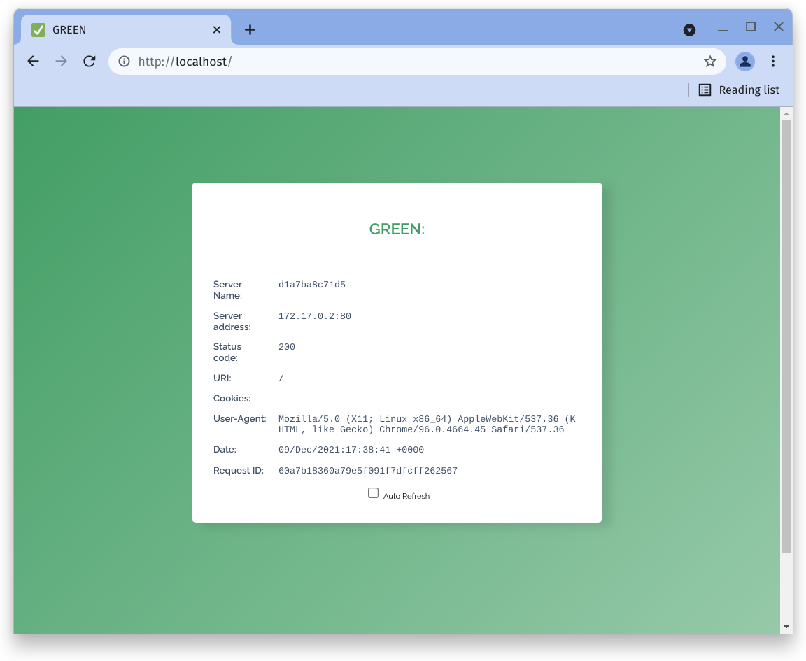
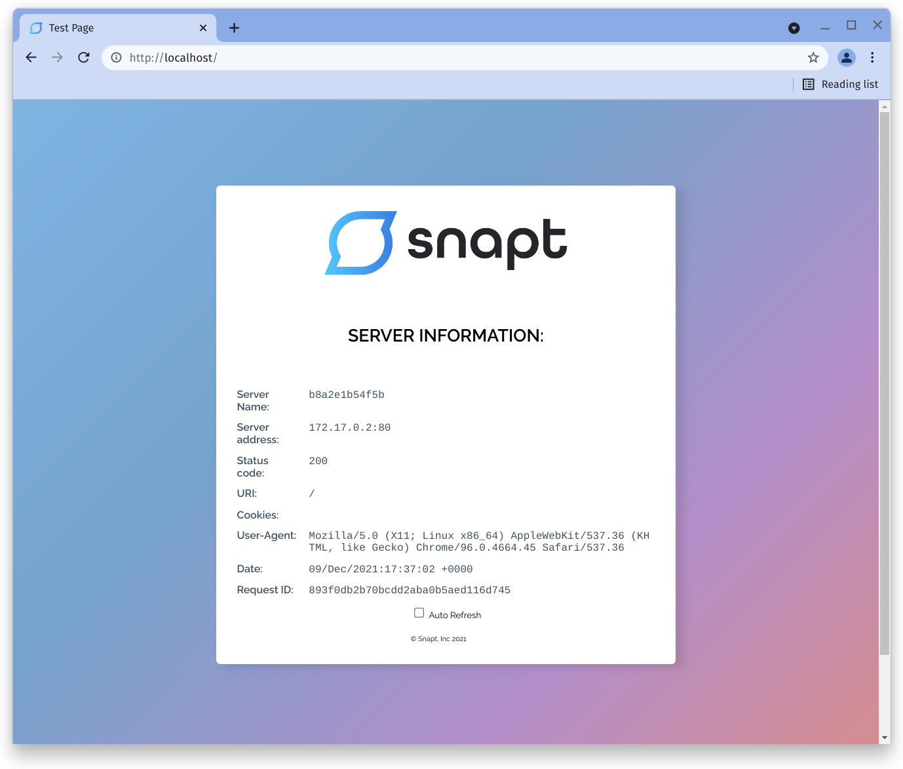

# Test-page

Simple web apps running on NGINX for proxy and load balancing demos 

NGINX webserver that serves a simple page containing its hostname, IP address
and port as wells as the request URI and the local time of the webserver.

There is a non-root image flavour of each available and it runs on port 8080
instead of typical port 80

## Screenshots

### `armsultan/test-page:plain-text`

```bash
curl <ip>:<port>

Server name: 318f4b9d2b6b
Server address: 172.17.0.2:80
Status code: 200
URI: /
Cookies: 
User-Agent: curl/7.74.0
Date: 08/Dec/2021:20:17:06 +0000
Request ID: e51ab69a0c78cdec290affe3ce65d841
```

### `armsultan/test-page:json`

```bash
curl <ip>:<port>
{
    "data": [
        {
            "Server name": "a401c6a20b10",
            "Server address": "172.17.0.2:80",
            "Status code": "200",
            "URI": "/",
            "Cookies": "",
            "User-Agent": "curl/7.74.0",
            "Date": "08/Dec/2021:21:02:19 +0000",
            "Request ID": "fc1880280ae2d2011eac0e28a0eaeaa3"
        }
    ]
}
```

### `armsultan/test-page:html`


### `armsultan/test-page:html-blue`


### `armsultan/test-page:html-green`


### `armsultan/test-page:html-planets`

Test pages include:
 * `earth.html`
 * `jupiter.html`
 * `mars.html`
 * `mercury.html`
 * `neptune.html`
 * `saturn.html`
 * `sun.html`
 * `uranus.html`
 * `venus.html`


### `armsultan/test-page:html-moons`

Test pages include:
 * `ariel.html`
 * `callisto.html`
 * `dione.html`
 * `enceladus.html`
 * `europa.html`
 * `ganymede.html`
 * `lo.html`
 * `mimas.html`
 * `miranda.html`
 * `moon.html`
 * `oberon.html`
 * `proteus.html`
 * `rhea.html`
 * `tethys.html`
 * `titan.html`
 * `titania.html`
 * `triton.html`
 * `umbriel.html`


### `armsultan/test-page:html-snapt`



### `armsultan/solar-system:[planet|moon]`

Each Planet and Moon in [html-solar-system](html-solar-system) has a
container image. They are all single page HTML files.

Examples of sun (`armsultan/solar-system:sun`) and moon (`armsultan/solar-system:sun`)


## How-to

### Pull and run from Docker Hub

**Web Server running as root, webpages published on port 80**

```bash
# Plain text page (Root and Non-Root)
docker run -p 80:80 -d armsultan/test-page:plain-text
docker run -p 8080:8080 -d armsultan/test-page:plain-text-nonroot

# JSON page (Root and Non-Root)
docker run -p 80:80 -d armsultan/test-page:json
docker run -p 8080:8080 -d armsultan/test-page:json-nonroot

# HTML Simple page (Root and Non-Root)
docker run -p 80:80 -d armsultan/test-page:html
docker run -p 8080:8080 -d armsultan/test-page:html-nonroot

# HTML Blue page (Root and Non-Root)
docker run -p 80:80 -d armsultan/test-page:blue
docker run -p 8080:8080 -d armsultan/test-page:blue-nonroot

# HTML Green page (Root and Non-Root)
docker run -p 80:80 -d armsultan/test-page:green
docker run -p 8080:8080 -d armsultan/test-page:green-nonroot

# HTML Planets page (Root and Non-Root)
docker run -p 80:80 -d armsultan/test-page:planets
docker run -p 8080:8080 -d armsultan/test-page:planets-nonroot

# HTML Moons page (Root and Non-Root)
docker run -p 80:80 -d armsultan/test-page:moons
docker run -p 8080:8080 -d armsultan/test-page:moons-nonroot

# HTML Snapt branded page (Root and Non-Root)
docker run -p 80:80 -d armsultan/test-page:snapt
docker run -p 8080:8080 -d armsultan/test-page:snapt-nonroot

# HTML Solar-System pages (Root and Non-Root), e.g. moon
docker run -p 80:80 -d armsultan/solar-system:moon
docker run -p 8080:8080 -d armsultan/solar-system:moon-nonroot
```


### Build and Push Docker images to Container repo

See the simple build scripts provided to build the container images and push to
your Docker hub container repository

To build Multi-Arch images you need [`buildx`](https://github.com/docker/buildx).
See the [buildx Getting started guide](https://github.com/docker/buildx#getting-started)


Build images

 * Build Images and push to docker hub - `build-push.sh` 
 * Build **Multi-Arch** Images and push to docker hub - `build-solar-system-multiarch.sh` 

Build solar-system images

 * Build Images and push to docker hub - `build-solar-system.sh` 
 * Build **Multi-Arch** Images and push to docker hub - `build-solar-system-multiarch.sh` 


### Mount local web content

```bash
# Mount local files, For example
docker run -d -p 80:80 \
    -v $PWD/html-simple/index.html:/usr/share/nginx/html/index.html \
    test-page:html
```
