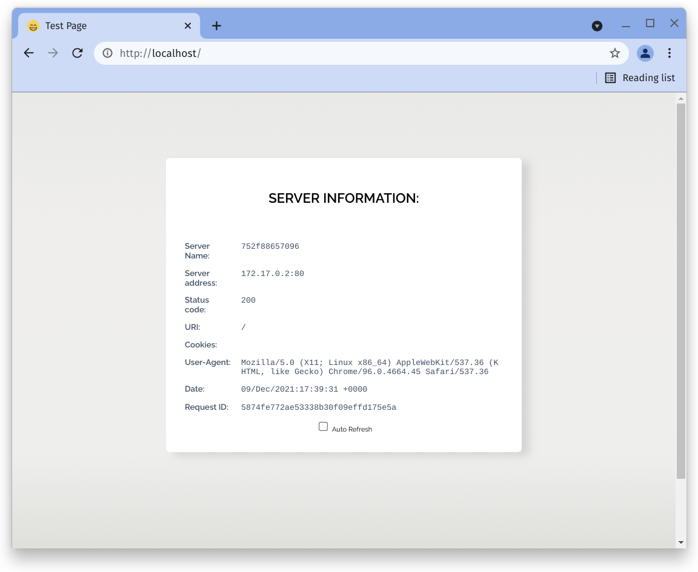

# Test-page

Simple web apps running on NGINX for proxy and load balancing demos 

NGINX webserver that serves a simple page containing its hostname, IP address
and port as wells as the request URI and the local time of the webserver.

There is a non-root image flavour of each available and it runs on port 8080
instead of typical port 80

## Screenshots

`armsultan/test-page:plain-text`
```bash
curl <ip>:<port>

Server name: 318f4b9d2b6b
Server address: 172.17.0.2:80
Status code: 200
URI: /
Cookies: 
User-Agent: curl/7.74.0
Date: 08/Dec/2021:20:17:06 +0000
Request ID: e51ab69a0c78cdec290affe3ce65d841
```

`armsultan/test-page:json`
```bash
curl <ip>:<port>
{
    "data": [
        {
            "Server name": "a401c6a20b10",
            "Server address": "172.17.0.2:80",
            "Status code": "200",
            "URI": "/",
            "Cookies": "",
            "User-Agent": "curl/7.74.0",
            "Date": "08/Dec/2021:21:02:19 +0000",
            "Request ID": "fc1880280ae2d2011eac0e28a0eaeaa3"
        }
    ]
}
```

`armsultan/test-page:html`


`armsultan/test-page:html-blue`


`armsultan/test-page:html-green`


`armsultan/test-page:html-planets`
Test pages include:
 * `earth.html`
 * `jupiter.html`
 * `mars.html`
 * `mercury.html`
 * `neptune.html`
 * `saturn.html`
 * `sun.html`
 * `uranus.html`
 * `venus.html`


`armsultan/test-page:html-snapt`


## How-to

### Pull and run from Docker Hub

**Web Server running as root, webpages published on port 80**

```bash
# Plain text page
docker run -P -d armsultan/test-page:plain-text

# JSON page
docker run -P -d armsultan/test-page:json

# HTML Simple page
docker run -P -d armsultan/test-page:html

# HTML Blue page
docker run -P -d armsultan/test-page:blue

# HTML Green page
docker run -P -d armsultan/test-page:green

# HTML Snapt branded page
docker run -P -d armsultan/test-page:snapt
```

**Web Server running as root, webpages published on port 8080**

```bash
# Plain text page
docker run -P -d armsultan/test-page:plain-text-nonroot

# JSON page
docker run -P -d armsultan/test-page:json-nonroot

# HTML Simple page
docker run -P -d armsultan/test-page:html-nonroot

# HTML Blue page
docker run -P -d armsultan/test-page:blue-nonroot

# HTML Green page
docker run -P -d armsultan/test-page:green-nonroot

# HTML Snapt branded page
docker run -P -d armsultan/test-page:snapt-nonroot
```

### Build and Run Docker images locally

```bash
# PLAIN TEXT PAGE
# Build 
docker build --no-cache -t test-page:plain-text -f DockerfilePlainText .
# Run
docker run -d -p 80:80 test-page:plain-text

# JSON PAGE
# Build 
docker build --no-cache -t test-page:json -f DockerfilePlainJSON .
# Run
docker run -d -p 80:80 test-page:json


# HTML SIMPLE PAGE
# Build 
docker build --no-cache -t test-page:html -f DockerfileHtml .
# Run
docker run -d -p 80:80 test-page:html

# HTML BLUE PAGE
# Build 
docker build --no-cache -t test-page:blue -f DockerfileBlue .
# Run
docker run -d -p 80:80 test-page:blue

# HTML GREEN PAGE
# Build 
docker build --no-cache -t test-page:green -f DockerfileGreen .
# Run
docker run -d -p 80:80 test-page:green

# HTML PLANET PAGES
docker build --no-cache -t test-page:planets -f DockerfilePlanets .
# Run
docker run -d -p 80:80 test-page:planets

# HTML SNAPT INC BRANDED PAGE
docker build --no-cache -t test-page:snapt -f DockerfileSnapt .
# Run
docker run -d -p 80:80 test-page:snapt
```

### Mount local web content

```bash
# Mount local files, For example
docker run -d -p 80:80 \
    -v $PWD/html-snapt/index.html:/usr/share/nginx/html/index.html \
    test-page:snapt
```

### Push to your own Docker Hub

```
# For example
docker tag test-page:plain-text armsultan/test-page:plain-text
docker push armsultan/test-page:plain-text
```

